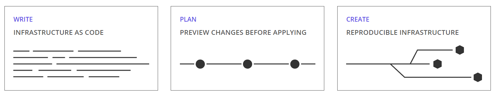
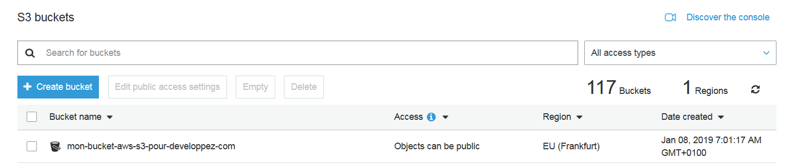
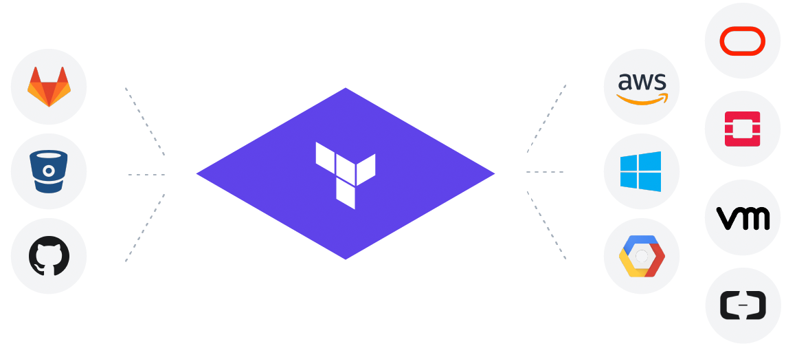
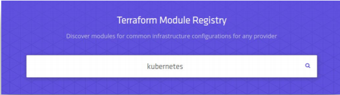
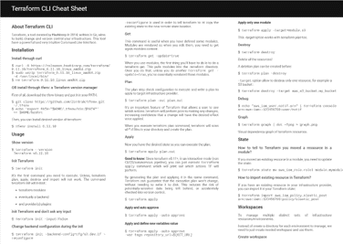

# Qu’est ce que Terraform ?

[Terraform](https://www.terraform.io/) est un outil créé en 2014 par HashiCorp, la société qui a créé d’autres outils que vous connaissez surement : Consul, Vagrant, Vault, Atlas, Packer et Nomad.


C’est un outil Open Source, écrit en Go, avec une communauté active de plus de 1200 contributeurs, plus de 13000 stars sur Github, et qui repose sur une architecture basée sur les plugins.

Terraform (TF) est un outil qui permet de *construire*, *modifier* et *versionner* une infrastructure.
Contrairement à ce que l’on peut lire sur internet, la technologie n’est pas plateforme agnostique MAIS elle permet d’utiliser plusieurs providers dans un même template de configuration. Il existe en effet des plugins pour des providers de Cloud, des services d’hébergement, des SCM … Nous le verrons un peu plus tard dans cet article.

Que fait l’outil ?

* Il assure la création et la cohérence d’infrastructure
* Il permet d’appliquer des modifications incrémentales
* On peut détruire des ressources si besoin
* On peut prévisualiser les modifications avant de les appliquer

Concrêtement, Terraform permet de créer automatiquement son infrastructure, comme par exemple des machines virtuelles, des lambdas AWS ... le tout, simplement, en 3 étapes :



1. *Write* : on écrit la définition de ses ressources dans des fichiers .tf
2. *Plan* : un plan des ressources à créer/modifier & supprimer est affiché, avant tout changement
3. *Create* : l'infra voulue est mise en place, et reproductible dans tous les environnments souhaités

L'exemple ci-dessous montre que, en quelques lignes de code, on va pouvoir déployer/créer un bucket S3 sur AWS :

```
resource "aws_s3_bucket" "com-developpez-terraform" {
  bucket = "mon-bucket-aws-s3-pour-developpez-com"
  acl    = "private"

  tags {
    Contact = "Aurelie Vache"
  }
}
```

Résultat sur AWS :



# Concepts

On va voir ensemble quelques concepts :

## HCL

Les fichiers de configurations s’écrivent en HCL (HashiCorp Configuration Language). Le principe est d’écrire des ressources.
Les ressources peuvent être écrites en JSON également mais il est recommandé de les écrire en HCL.
Lire un fichier de configuration HCL est plutôt simple et intuitif.


C’est un langage dit “human readable”. Ce qu’il faut savoir c’est que Terraform scan tous les fichiers se terminant par .tf dans le répertoire courant, il ne va pas scanner les répertoires enfants par contre.

## Provider

Un provider est responsable du cycle de vie/du CRUD d’une ressource : sa création, sa lecture, sa mise à jour et sa suppression.

Plus de 125 providers sont actuellement supportés :

* AWS, GCP, Azure, OpenStack …
* Heroku, OVH, 1&1 ...
* Consul, Chef, Vault ...
* Docker, Kubernetes ...
* GitLab, BitBucket, GitHub ...
* MySQL, PostgreSQL ...
* mais encore RabbitMQ, DNSimple, CloudFlare …



La liste complète des providers est disponible sur le site de TF : [https://www.terraform.io/docs/providers/index.html](https://www.terraform.io/docs/providers/index.html)

Vous ne trouvez pas le provider de votre rêve ? Pas de soucis vous pouvez écrire votre propre plugin et participer à l’élaboration de nouvelles fonctionnalités de Terraform. Si vous ne codez pas encore en Go, ce sera l’occasion de vous y mettre ;-).

Pour configurer un provider, nous voulons par exemple déployer une infra AWS, il suffit de créer une ressource provider “aws” dans un fichier se terminant par .tf :

`root.tf` :

```
provider "aws" {
  region = "eu-central-1"
}
```

Bonne pratique : ne pas mettre les credentials directement dans la ressource provider aws mais de setter vos variables d’environnement :

```
$ export AWS_ACCESS_KEY=YOUR_ACCESS_KEY
$ export AWS_SECRET_ACCESS_KEY=YOUR_SECRET_KEY
$ export AWS_DEFAULT_REGION=eu-central-1
```

Ou bien vous pouvez les mettre dans un fichier .aws/credentials :

```
[default]
aws_access_key_id = YOUR_ACCESS_KEY
aws_secret_access_key = YOUR_SECRET_KEY
```

Attention, il en va de soi que vous devrez prendre les tokens d’un utilisateur qui aura les droits/la bonne policy pour créer les services que vous voulez.
Variables
Afin de faire du code propre et qui se réutilise, il est recommandé d’initialiser des variables et de les utiliser dans les autres fichiers .tf.

Définissez vos variables dans un fichier `variables.tf`, par exemple :

```
variable "default-aws-region" {
  default = "eu-central-1"
}

variable "aws_account_id" {
  default = "123456789123"
}

variable "tags-tool" {
  default = "Terraform"
}

variable "tags-contact" {
  default = "Aurelie Vache"
}

variable "aws_s3_folder" {
  default = "s3"
}

variable "aws_s3_bucket_terraform" {
  default = "com.developpez.terraform"
}
```

Appelez les dans vos ressources :

`aws_s3.tf` :

```
resource "aws_s3_bucket" "com-developpez-terraform" {
  bucket = "${var.aws_s3_bucket_terraform}"
  acl    = "private"

  tags {
    Tool    = "${var.tags-tool}"
    Contact = "${var.tags-contact}"
  }
}
```

## Modules

Les modules sont utilisés pour créer des composants réutilisables, améliorer l’organisation et traiter les éléments de l’infrastructure comme une boite noire.
C’est un groupe de ressources qui prennent en entrée des paramètres et retournent en sortie des outputs.

Dans le même fichier, `root.tf`, dans lequel vous avez défini votre provider, vous pouvez ensuite définir vos modules :

```
module "lambda" {
  source            = "./lambda/"
  toto              = "${var.aws_s3_bucket_toto_lambda_key}"
  titi              = "${var.aws_s3_bucket_titi_key}"
  tutu              = "${var.aws_s3_bucket_tutu_key}"
}
```

## Outputs

Les modules peuvent produire des outputs que l’on pourra utiliser dans d’autres ressources.

`lambda/outputs.tf` :

```
output "authorizer_uri" {
  value = "${aws_lambda_function.lambda_toto.invoke_arn}"
}
```

`aws_api_gw.tf` :

```
resource "aws_api_gateway_authorizer" "custom_authorizer" {
  name                             = "CustomAuthorizer"
  rest_api_id                      = "${aws_api_gateway_rest_api.toto_api.id}"
  authorizer_uri                   = "${module.lambda.authorizer_uri}"
  identity_validation_expression   = "Bearer .*"
  authorizer_result_ttl_in_seconds = "30"
}
```

## Data Sources

Les data sources (aka sources de données) servent à récupérer une donnée/ressource existante dans votre infra.

Utiliser une data source est une bonne pratique. En effet, il est bon de privilégier son utilisation plutôt que de hardcodé des subnet_id, account_id ou autre donnée qui peut être récupérée ! ;-)

`data.tf` :

```
# VPC
data "aws_subnet" "subnet_id_1" {
  filter {
    name = "tag:Name"
    values = ["mysubnet-for-developpez"]
 }
}
```

Et ensuite vous pouvez appeler cette datasource simplement dans vos fichiers .tf comme ceci :

`root.tf` :

```
module "developpez" {
    source = "developpez"
    subnet_id_1 = "${data.aws_subnet.subnet_id_1.id}"
}
```

## External Data Source

Comme nous l'avons vu, il est possible de récupérer une data source grâce à un système de filtre. C'est super ... mais, et oui il y a un mais ... maleureusement ce filtering n'est pas possible avec tous les types de ressources.

Imaginons que nous souhaitons récupérer un (network) load balancer, chez AWS, pour pouvoir créer une AWS Route 53 Record (entrée dans un nom de domaine). Nous ne pouvons appliquer un filtre sur ce type de ressource, nous allons donc devoir trouver une parade pour récupérer notre fameux load balancer.

La solution est de :

1. Créer un script qui récupère la ressource

2. Utiliser le résultat de ce script dans une data source Terraform avec un *external provider*

3. Utiliser cette donnée spéciale dans une ressource que vous voulez créer

### 1. Création du script

`my_module/scripts/get_elb.sh` :

```
#!/bin/bash
set -e
kubectl get svc mygateway -n istio-system -o json | jq .status.loadBalancer.ingress[0]
```

Ce script retourne un objet JSON contenant une gateway Kubernetes (Istio) (côté infrastructure il s'agit d'un AWS Load Balancer):

```
$ ./my_module/scripts/get_elb.sh 
{
"hostname": "a123456789gsfgfsgfsg12134gsgsg78-123456789dfdsf45545fdsf.elb.eu-central-1.amazonaws.com"
}
```

### 2. Définition de l'external data source

`my_module/data.tf` :

```
data"external" "elb" {
     program= ["bash", "${path.module}/scripts/get_elb.sh"]
}
```

### 3. Définition de la ressource souhaitée

`my_module/aws_r53.tf` :

```
resource "aws_route53_record""mymodule_CNAME" {
    zone_id="${data.aws_route53_zone.my_zone.zone_id}"
    name="${var.domain_name}"
    type="CNAME"
    records= ["${data.external.elb.result.hostname}"]
    ttl="${var.route53_ttl}"
}
```

## State

Un state est un snapshot de votre infrastructure depuis la dernière fois que vous avez exécuté la commande terraform apply.


Terraform utilise un local storage pour créer les plans et effectuer les changements sur votre infra. Mais il est possible de stocker ce state, dans le cloud.
Pour configurer le stockage de ce state en remote, il suffit de définir un backend.

`backend.tf` :

```
# Backend configuration is loaded early so we can't use variables

terraform {
  backend "s3" {
    region  = "eu-central-1"
    bucket  = "com.developpez.terraform"
    key     = "state.tfstate"
    encrypt = true
  }
}
```

# CLI

Terraform a une CLI (Command-Line Interface) facile à utiliser et est composée de plusieurs commandes, nous allons en voir quelques unes, pas toutes, uniquement celles que j’utilises le plus au quotidien.

## Init

`$ terraform init`

Cette commande va initialiser votre working directory qui contient vos fichiers de configuration en .tf.
C’est la première commande à exécuter pour une nouvelle configuration, ou après avoir fait un checkout d’une configuration existante depuis votre repo git par exemple.

La commande init va :

* télécharger et installer les providers
* initialiser le backend (si définit)
* télécharger et installer les modules (si définit)
  
## Plan

`$ terraform plan`

La commande plan permet de créer un plan d’exécution. Terraform va déterminer quelles actions il doit faire afin d’avoir les ressources listées dans les fichiers de configuration par rapport à ce qui est actuellement en place sur l’environnement/le provider cible.
Cette commande n’effectue concrètement rien sur votre infra.

Bonne pratique : afin de sauver le plan, vous pouvez spécifier un fichier de sortie :

`$ terraform plan -out developpez.out`

## Apply

`$ terraform apply developpez.out`

La commande apply, comme son nom l’indique, permet d’appliquer les changements à effectuer sur l’infra. C’est cette commande qui va créer nos ressources.

Attention, depuis la version 0.11 de Terraform, sorti le 16 novembre dernier, lorsque vous utilisez TF dans un environnement interactif, en local par exemple, mais pas en CI/CD, il est recommandé de ne plus passer par un plan mais de directement faire un apply et de répondre Yes si vous souhaitez appliquer ce plan.

## Providers

Après application de la définition de vos ressources, vous pouvez vérifier les providers utilisés par Terraform dans votre projet & modules :

```
$ terraform providers
.
├── provider.aws ~> 1.54.0
└── module.my_module
├── provider.aws (inherited)
└── provider.external
```

## Destroy

`$ terraform destroy`

La commande destroy permet de supprimer TOUTES les ressources.

Un plan de suppression peut être généré au préalable :

`$ terraform plan -destroy`

## Console

Grâce à la CLI console, vous pouvez connaitre la valeur d’une ressource terraform. Cette commande est pratique pour faire du debug, avant de créer un plan ou de l’appliquer.

```
$ echo "aws_iam_user.developpez.arn" | terraform console
arn:aws:iam::123456789123:user/developpez
```

## Get

`$ terraform get`

Cette commande est utile si par le passé vous avez déjà fait un terraform init puis ajouté un module, il faut préciser maintenant a terraform qu’il faut récupérer le module ou bien le mettre à jour. Si vous ne le faites pas, lors de d’un terraform plan, TF vous demandera de le faire ;-).

## Graph

`$ terraform graph | dot -Tpng > graph.png`

La CLI graph permet de dessiner un graphique de dépendances visuelle des ressources terraform en fonction des fichiers de configuration.


Au bout d’un certains nombre de ressources dans un répertoire, terraform n’arrive plus à générer ce graphique. J’espère que ce problème sera corrigé dans les futures version ;-).

# Pratiques != Bonnes pratiques

Si vous vous êtes déjà renseignés sur Terraform avant de consulter ce tutoriel, vous avez sans doute vu que la pratique d'organisation du code que l'on voit sur le net est que toutes les ressources Terraform sont écrites dans un fichier *main.tf* qui contient un peu de tout : la définition des ressources à créer, la définition du remote state, de la version du/des providers à utiliser ...

Personnellement je ne recommande pas du tout cette approche.
Je pense qu’il ne faut pas confondre les pratiques et les bonnes pratiques.

Faire du Terraform c’est faire de l’Infratsrucure as Code et donc c’est faire/écrire du code. Il s'agit donc de coder coder proprement. Afin que le code puisse être maintenable, s'il y a une bonne pratique à savoir est q'il vaut mieux bien organiser son code et ce cas s'applique également pour de l'IaC et donc nos fichiers Terraform.

Aurevoir l'énorme fichier main.tf contenant des torchons, des serviettes et des chaussettes (ou plutpot du GCP, Azure, AWS, Kubernetes, Vault ....) et bonjour une organisation de fichier .tf qui conciste à séparer par fichier par types de ressources et à utiliser des modules.

Exemple :

```
.
├── backend.tf
├── cfg
│   ├── s3.dev.tf
│   ├── s3.prerprod.tf
│   └── s3.prod.tf
├── mymodule1
│   ├── aws_acm.tf
│   ├── aws_api_gateway.tf
│   ├── aws_cloudwatch.tf
│   ├── aws_iam.tf
│   ├── aws_kinesis.tf
│   ├── aws_lambda.tf
│   ├── aws_r53.tf
│   ├── aws_s3.tf
│   ├── data.tf
│   ├── output.tf
│   ├── resources
│   │   └── swagger.json
│   └── variables.tf
├── data.tf
├── mymodule2
│   ├── aws_els.tf
│   ├── output.tf
│   └── variables.tf
├── root.tf
├── scripts
│   ├── migrateMapping.sh
│   └── resources
│       └── myproject.json
└── variables.tf
```

# Utilisation

Trève de blabla, passons à la pratique !

## 0. Installation

Commençons tout d’abord par installer Terraform :

```
$ curl -O https://releases.hashicorp.com/terraform/0.11.10/terraform_0.11.10_linux_amd64.zip
$ sudo unzip terraform_0.11.10_linux_amd64.zip -d /usr/local/bin/
$ rm terraform_0.11.10_linux_amd64.zip
```

0.11.10 étant la dernière version de Terraform, stable, à ce jour.
Ces commandes vont extraire un binaire dans */usr/local/bin/*, qui est déjà dans votre PATH.

Vous pouvez également installer Terraform grâce a tfenv, un Terraform version manager :
La première chose à faire, est de télécharger le binaire de tfenv et de le mettre dans votre PATH :

```
$ git clone https://github.com/Zordrak/tfenv.git
 ~/.tfenv
$ echo 'export PATH="$HOME/.tfenv/bin:$PATH"'
 >> $HOME/bashrc
```

Ensuite, vous pouvez simplement installer Terraform ou le mettre à jour en précisant la version désirée :

`$ tfenv install 0.11.10`

Afin de vérifier que Terraform est correctement installé, veuillez vérifier la version courante de l’outil :

```
$ terraform --version
 Terraform v0.11.10
```

Info: terraform -version fonctionne également.

## 1. Initialisation du projet - Création d’un répertoire

`$ mkdir developpez/`

## 2. Création d'une ressource

```
$ vi aws_s3.tf
############### AWS S3 ###############
resource "aws_s3_bucket" "com-developpez-terraform" {
bucket = "${var.aws_s3_bucket_terraform}"
acl = "private"
    tags {
        Tool = "${var.tags-tool}"
        Contact = "${var.tags-contact}"
    }
}
```

## 3. Pré-requis

Pour indiquer à terraform sur quel compte AWS vous souhaitez déployer l'infrastructure souhaitée, vous devez définir des variables d'environnement AWS au préalable, par exemple dans un fichier .aws/credentials ou avec des variables d'environnement : 
 
```
$ export AWS_ACCESS_KEY_ID="an_aws_access_key"
$ export AWS_SECRET_ACCESS_KEY="a_aws_secret_key"
$ export AWS_DEFAULT_REGION="a-region"
```

## 4. Initialiser Terraform

```
$ terraform init
[0m[1mDownloading modules...[0m
[0m[1mInitializing the backend...[0m
[0m[1mInitializing provider plugins...[0m
The following providers do not have any version constraints in configuration,
so the latest version was installed.
To prevent automatic upgrades to new major versions that may contain breaking
changes, it is recommended to add version = "..." constraints to the
corresponding provider blocks in configuration, with the constraint strings
suggested below.
* provider.aws: version = "~> 1.3"
```

## 5. Plan

```
$ terraform plan -out crf.out
Refreshing Terraform state in-memory prior to plan...
The refreshed state will be used to calculate this plan, but will not be
persisted to local or remote state storage.
aws_s3_bucket.com-developpez-terraform: Refreshing state... (ID: com.developpez.terraform)
…
Plan: 1 to add, 0 to change, 0 to destroy.
```

## 6. On applique le plan

```
$ terraform apply plan.out
…
Apply complete! Resources: 1 added, 0 changed, 0 destroyed.
```

# Outils & Tips

## jq

jq est un comand-line JSON processor léger. Combiné avec les output de Terraform cela peut être très puissant.

### Installation

`$ sudo apt install jq`

### Utilisation

Nous allons récupérer uniquement le endpoint d'un elasticsearch :

```
$ terraform output -json | jq '.elastic_endpoint.value'
"vpc-toto-12fgf1235f4d1235get123.eu-central-1.es.amazonaws.com"
```

## Terraforming

Afin de nous faciliter la vie, il y a quelques petits outils intéressant à connaître et à utiliser. Si vous avez une infra AWS existante et que vous devez la dupliquer dans plusieurs autres comptes, Terraforming (https://github.com/dtan4/terraforming) est fait pour vous. C’est un outil écrit en Ruby qui permet d’extraire des ressources AWS existantes et de générer un fichier terraform correspondant.

Pour l’installer, voici la marche à suivre :

```
$ sudo apt install ruby
$ gem install terraforming
```

Pour extraire un type de ressources c’est très simple. Par exemple si l’on veut extraire des buckets s3 :

`$ terraforming s3 > aws_s3.tf`

Comme vous pouvez le constater si vous testez cette commande sur un compte AWS qui contient des buckets s3, cette dernière n’extrait que les buckets, elle n’extrait pas les objets : les zip, jar et divers fichiers contenus dans vos buckets.
Il vous faudra du coup écrire les ressources aws_s3_object comme celle-ci :

```
resource "aws_s3_bucket_object" "authorizer_keystore" {
  bucket = "${var.aws_s3_bucket_authorizer}"
  key    = "${var.aws_s3_bucket_authorizer_keystore_key}"
  source = "${var.aws_s3_folder}/${var.aws_s3_bucket_authorizer_keystore_key}"
  etag   = "${md5(file("${var.aws_s3_folder}/${var.aws_s3_bucket_authorizer_keystore_key}"))}"

  tags {
    Tool    = "${var.tags-tool}"
    Contact = "${var.tags-contact}"
  }
}
```

Attention, terraforming ne prend pas en compte toutes les ressources AWS, notamment les API Gateway. De ce fait, même si vous souhaitez dupliquer une API GW existante, il vous faudra vous les écrire à la mimine.

## Gitignore

`.gitignore` :

```
#  Local .terraform directories
**/.terraform/*

# .tfstate files
*.tfstate
*.tfstate.*

# .tfvars files
*.tfvars

# .out files
*.out
```

## Module registry



Plutôt que de créer vos propre modules, une autre bonne pratique est de consulter avant sur le [module registry](https://registry.terraform.io/) s'il en existe pas déjà un répondant à vos besoin.

## Terraform CLI Cheat Sheet

En tant que développeur et DevOps on aime bien avoir des petits guide qui nous résument tout ce qu'il y a à savoir sur une technologie. N'en ayant pas trouver d'existante concernant Terraform, j'ai décidé de créer ma propre Cheat SHeet que j'ai mis sur Github afin de le partager à tout le monde : [github.com/scraly/terraform-cheat-sheet](https://github.com/scraly/terraform-cheat-sheet/)



# Terraform VS CloudFormation

Terraform n’est pas le seul a pouvoir faire de l’infrastruce as Code. Lorsque l’on parle de AWS il y a également CF qui existe.
Voici un petit tableau qui compare les deux technologies :

## Terraform

* Support de presque tous les services AWS et d’autres (cloud) providers
* Open Source
* Pas de rolling update pour les ASG (Auto Scaling Group)
* HCL/JSON
* State management
* Support de Vault

## CloudFormation

* Support de presque tous les services AWS (uniquement ce cloud provider!)
* Service géré et “offert” par AWS
* Le rolling update d’EC2 par un ASG est supporté
* JSON / YAML (depuis 2016)
* Pas de State management

Il n’y a pas de meilleure techno, chacune à ses avantages et ses inconvénients. CloudFormation couvre un peu + de ressources AWS pour le moment que TF, mais ne prend pas en compte d’autres providers.

A noter qu’il est possible de charger du CloudFormation (CF) dans du Terraform, si par exemple vous avez déjà votre stack écrite en CF :

```
# Setup of an CloudformationStack with terraform
resource "aws_cloudformation_stack" "my_stack" {
    depends_on = [
        "aws_s3_bucket_object.lambda_code",
        "aws_s3_bucket_object.authorizer"
    ]
    name = "${var.cf_stack_name}"
    template_url = "https://${aws_s3_bucket.deployment_bucket.bucket_domain_name}/cf_logic.json"
    provider = "aws.region"
 
    parameters {
        LambdaCodeAuthorizer = "${basename(var.authorizer_lambda_jar)}",
        S3CodeBucket = "${aws_s3_bucket.deployment_bucket.id}",
        ...
    }
 
    tags {
        Tool    = "${var.tags-tool}"
    	  Contact = "${var.tags-contact}"
    }
}
```

# Avantages / Inconvénients

Terraform n’est pas une baguette magique, cette technologie a des inconvénients, comme pour toutes les technos. Il s’agit notamment d’un outil assez jeune, et en constante évolution donc il y a des bugs et toutes les ressources de tous les providers ne sont pas encore pris en compte.

On peut dresser une petite liste de “Pros” et de “Cons :

## Avantages

* Permet de définir de l’Infrastructure as Code
* Syntaxe concise et lisible
* Réutilisation de : variables, inputs, outputs, modules
* Commande plan
* Multi cloud support
* Développement très actif

## Inconvénients

* Outil jeune (comporte des bugs)
* Pas de rollback possible
* Assez verbeux
* Pauvre gestion des secrets (à combiner avec Vault par exemple !)

J’ajouterai que les messages d’erreurs ne sont pas super explicite :

```
* module.lambda.aws_lambda_function.lambda_toto: 1 error(s) occurred:

* module.lambda.aws_lambda_function.lambda_toto: aws_lambda_function.lambda_toto: InvalidSignatureException: Signature expired: 20171218T075729Z is now earlier than 20171218T080647Z (20171218T081147Z - 5 min.)
	status code: 403, request id: 17c82bc7-e3cb-11e7-8a7e-6b18fbf66fae
```

# Conclusion

Ma conclusion personnelle est que Terraform est un des outils qui permet de faire de l’Infrastructure as Code et de passer du ClickOps au DevOps. 

Mais faire du terraform en local ce n’est pas la vraie vie, donc nous pourrons voir dans un prochain épisode comment automatiser la création de ressources écrites en Terraform dans une chaine de Continuous Integration/Continuous Deployment avec notre fidèle compagnon : Jenkins.

Nous verrons également comment manipuler les worskspaces pour faire du Terraform dans un contexte multi environnements en ne définissant les ressources qu'une seule fois.

Nous pourrons également voir qu'il n'existe pas que CloudFormation ou Terraform, pour gérer des ressources sur AWS, donc nous ferons un comparatif avec les Opérateurs Kubernetes AWS et nous verrons comment se fait la mise en pratique.